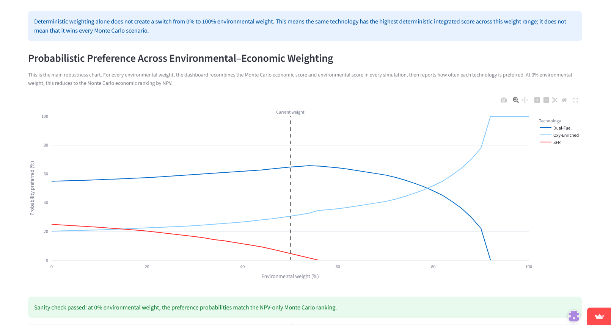

# LCA–TEA Decision Support Dashboard

An interactive decision-support application integrating **Life Cycle Assessment (LCA)** and **Techno-Economic Analysis (TEA)** with uncertainty, sensitivity and robustness analysis.

**Live application:** https://lca-tea-dashboard-gpvtupivz4yiwzvv9zn2f.streamlit.app

## Dashboard preview



The dashboard moves beyond a single deterministic ranking by showing how technology preference changes across environmental–economic decision weights under uncertainty.

## Project overview

The dashboard demonstrates how environmental and economic evidence can be combined when comparing alternative technology pathways under uncertainty. The case study evaluates three low-calorific landfill-gas utilisation pathways:

- **Dual-Fuel Combustion (DFC)**
- **Oxygen-Enriched Combustion (OEC)**
- **SFR with CO₂ Capture (SFR)**

Rather than relying only on a single deterministic LCA or NPV result, the application explores how technology preference changes when uncertain technical, economic, environmental and policy assumptions are considered.

## What the dashboard does

### 1. Environmental performance
Compares the technologies across LCIA impact categories and identifies the lowest-impact alternative for the selected category.

### 2. Environmental hotspot analysis
Identifies processes and contributions responsible for the largest environmental impacts, while reporting negative contributions separately from positive burdens.

### 3. Techno-economic analysis
Compares financial performance using indicators such as NPV, IRR and payback period based on the processed TEA model outputs.

### 4. Integrated LCA–TEA assessment
Combines normalized environmental and economic performance to examine trade-offs between environmental and financial objectives.

### 5. Sensitivity and decision-switch analysis
Tests how changes in important economic parameters affect technology NPVs and identifies conditions under which the preferred technology changes.

### 6. Monte Carlo uncertainty analysis
Propagates uncertainty through the TEA model using technology-specific probability distributions. Outputs include:

- probability of positive NPV,
- NPV uncertainty ranges,
- probability of each technology being economically preferred,
- deterministic versus probabilistic ranking comparison.

This distinguishes a technology with the highest deterministic NPV from one that is most frequently preferred across uncertain scenarios.

### 7. Environmental–economic decision robustness
Combines Monte Carlo economic results with environmental performance and evaluates the **probability that each technology is preferred across different environmental/economic decision weights**.

This provides a robustness perspective rather than presenting a single weighted ranking as universally optimal.

### 8. CO₂-price policy threshold
Includes a policy-oriented sensitivity analysis for the SFR pathway. The demonstration estimates the CO₂-price level at which SFR becomes economically preferred under the current deterministic assumptions.

The current implementation follows the CO₂-linked revenue relationship used in the demonstration model. It should therefore be interpreted as a **scenario/policy threshold**, not as a universal carbon-price recommendation.

## Decision-support concept

The analytical logic is:

```text
LCA results ───────────────┐
                          ├─> Integrated performance
TEA results ───────────────┘          │
                                     ▼
Sensitivity analysis          Deterministic ranking
        │                            │
        ▼                            ▼
Decision-switch analysis     Monte Carlo uncertainty
                                     │
                                     ▼
                         Probabilistic technology ranking
                                     │
Environmental uncertainty/weights ──┤
                                     ▼
                         Decision robustness analysis
                                     │
                                     ▼
                         Decision-relevant recommendation
```

The objective is not simply to answer *“Which technology has the best baseline result?”* but also:

> **How robust is that preference when the assumptions and decision priorities change?**

## Methods and tools

The demonstration uses:

- Life Cycle Assessment (LCA)
- Techno-Economic Analysis (TEA)
- NPV / IRR / payback analysis
- Sensitivity analysis
- Monte Carlo simulation
- Probabilistic technology ranking
- Multi-impact environmental scoring
- Environmental–economic weighting
- Decision robustness analysis
- CO₂-price policy scenario analysis

The application is implemented in **Python / Streamlit**, with data processing and analysis using common scientific Python libraries.

## Repository structure

```text
app/
  dashboard.py

data/processed/
  lcia_results.csv
  hotspots.csv
  tea_summary.csv
  tea_cashflows.csv

docs/
  dashboard-robustness.png

.streamlit/
  config.toml

requirements.txt
README.md
```

Only processed demonstration data required by the public application are included in the repository.

## Run locally

```bash
python -m venv .venv
```

Activate the environment:

```bash
# Windows
.venv\Scripts\activate

# macOS/Linux
source .venv/bin/activate
```

Install dependencies and run:

```bash
pip install -r requirements.txt
streamlit run app/dashboard.py
```

## Public deployment

The application is deployed with Streamlit Community Cloud from the `main` branch using:

```text
app/dashboard.py
```

as the application entry point.

## Interpretation and limitations

This repository is a **decision-support demonstration** based on processed study data and documented modelling assumptions. Results should not be interpreted as universally applicable technology recommendations.

In particular:

- uncertainty distributions represent modelling assumptions and should be re-estimated for a real project;
- environmental category weights depend on the decision context;
- economic assumptions such as CAPEX, OPEX, revenues and discount rates are project-specific;
- the CO₂-price threshold is conditional on the SFR revenue relationship implemented in this demonstration;
- a real investment or policy assessment should replace demonstration assumptions with project-specific primary data where available.

The dashboard is therefore intended to demonstrate a framework for moving from **deterministic LCA–TEA results toward uncertainty-aware and decision-robust technology assessment**.

## Portfolio purpose

This project demonstrates practical integration of environmental assessment, techno-economic modelling, uncertainty analysis and interactive decision support. It is designed as a reproducible example of how quantitative sustainability assessment can be translated into information useful for technology, infrastructure and policy decisions.
